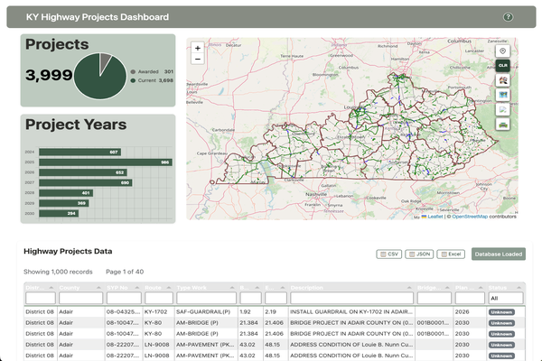

# KY Highway Projects Dashboard

An interactive web dashboard for visualizing Kentucky highway project data, featuring a geospatial map with filtering capabilities, automatic graph updates tied to the map extent, and a tabular representation of the project data, with export capabilities. This project is designed for educational and portfolio purposes and is not officially endorsed by the Kentucky Transportation Cabinet (KYTC).

---

## Project Overview

The KY Highway Projects Dashboard is an interactive web app that's designed to be responsive on any device. It helps interested users navigate through current and awarded highway construction projects in Kentucky. By using open data, interactive mapping, and dynamic data visualization, the dashboard makes it easy for the public, contractors, and government stakeholders to access trustworthy project information. Plus, it’s built with open web technologies, so there’s no need to rely on proprietary Esri tools.

**Purpose:**
- To ensure that Kentucky's highway project data is openly accessible to the public.
- To offer interactive tools that allow users to filter, map, and analyze project information easily.
- To showcase the development of GIS web applications, focusing on data visualization and JavaScript architecture.

**Educational/Portfolio Project:**
I created this dashboard on my own as a way to learn and showcase my skills. For more information, read the [Disclaimer](#disclaimer) section for details.

---

## Features

- **Interactive Map:**
  - Discover highway projects through a Leaflet.js map that offers various basemap options.
  - Click on the project lines to access detailed information in pop-up windows.
  - Zoom and pan to explore areas that interest you.

- **Multi-Level Filtering:**
  - Filter projects by KYTC district, county, and standardized project type.
  - Utilize search-enabled dropdowns for quick and easy selections.
  - Combine filters for a more detailed exploration of the data.

- **Dynamic Data Visualization:**
  - View a pie chart comparing awarded projects to current ones.
  - Check out a horizontal bar chart that shows project distribution over the years.
  - Charts refresh automatically based on the filters you have applied.

- **Advanced Data Table:**
  - Access a sortable, filterable, and paginated table containing project details.
  - Export the data in formats like CSV, JSON, or Excel (XLSX).

- **Basemap Switching:**
  - Select from basemaps such as OpenStreetMap, Esri World Street Map, USGS Topo, and OpenTopoMap through the Leaflet fetch process.

- **Clear All Filters:**
  - A one-click button allows you to reset all filters and return to the default view.

- **Responsive Design:**
  - The interface is optimized for both desktop and mobile devices.

- **API Integration:**
  - The project integrates with the KYTC Spatial API for route-specific data (accessible via map controls).

- **Accessible Help & Disclaimer:**
  - The project includes a [Help page](help.html) and a [Disclaimer](disclaimer.html).
---

## Live Demo
Visit the dashboard at: https://terid.github.io/KY_Highway_Plan_Projects/

---
## Use of AI Statement
As I have been a Python developer for many years, I feel that AI is an excellent tool that should be utilized.  I have employed AI to the benefit of existing ETLs and improve efficiency and performance. I did use AI during the building of this project. But, because of my previous experience, I know that an AI is only as good as the skills of the user.

My approach to AI in this project use was to build out individual components first in separate parts.  I started with my first component during week 2 of Module 1 when we were asked to "Create something of interest".  I began working on a mapping interface
and a call to the KYTC Spatial API (see https://terid.github.io/WebDev_PotholeReporter/).

Within Visual Studio Code, my preferred IDE, I utilize GitHub Copilot. My preferred AI agent for coding requests is Claude Sonnet 4. I have used it more rigorously in other projects, but limited its use within this project. AI was used in troubleshooting simle problems of missing brackets, but more often helped me find the cause of a particular bug. I also used it to assist with error-handling logic, like try/except blocks.

The use of AI didn't replace my judgement, but definitely made finding errors more efficient. I have found that while Chat GPT can answer questions, it's answers are frequently insufficient to solve issues fully. I did use Chat GPT to assist in creating my initial wireframe diagram. I know that CHAT GPT is frequently used to generate documentation, but I have written professional technical articles and documentation; Chat GPT's grammar is less than adequate.


## Dashboard Interface



*The interactive dashboard showing Kentucky highway projects with filtering controls, interactive map, charts, and data table.*

---

## Architecture & Technologies
**Frontend:**
- HTML5, CSS3 (utilizing Bootstrap 5), and JavaScript (ES6+)
- Responsive design with modular UI components

**Mapping & Visualization:**
- Using [Leaflet.js](https://leafletjs.com/) for interactive maps
- Implementing [Chart.js](https://www.chartjs.org/) for creating charts
- Employing [Tabulator.js](http://tabulator.info/) for advanced data tables

**Data Management:**
- Utilizing [SQL.js](https://sql.js.org/) for client-side SQLite database operations
- Managing spatial data layers with GeoJSON (projects, counties, districts)

---

## Data Sources

All the data utilized in this dashboard comes from **publicly available datasets** provided by the Kentucky Transportation Cabinet (KYTC) and various other open government data repositories. I have ensured that no proprietary or confidential information is included.

**Key Data Files:**
- `data/Current_Highway_Plans.geojson` — Georeferenced lines representing current highway projects
- `data/Awarded_Highway_Plans.geojson` — Georeferenced lines for highway projects that have been awarded
- `data/KY_Counties.geojson` — Boundaries of counties in Kentucky
- `data/KYTC_Districts.geojson` — Boundaries of Kentucky transportation districts
- `data/HighwayPlan_data.db` — SQLite database with tables and views related to highway projects

**Official KYTC Resources:**
- [KYTC Website](https://transportation.ky.gov)
- [KYTC Open Data Portal](https://data.ky.gov)

---

## Filtering System

The dashboard offers three levels of filtering, and right now, they function separately. In the future, I plan to enhance this so they can be used in combination:

### District Filter
- Allows filtering by KYTC districts (1-12)
- Automatically zooms in on district boundaries
- Updates all charts and tables to display data specific to the selected district

### County Filter
- Features a search-enabled dropdown for all Kentucky counties
- Users can type to find specific counties quickly
- Zooms in on county boundaries upon selection

### Project Type Filter
- Uses intelligent categorization through a crosswalk database
- Maps raw project types to standardized categories
- Includes a search function to easily find project types
- Displays a visual indicator to show which filter is active

### Dynamic Titles
- Panel titles update automatically to reflect the active filters
- For example:
  - "Projects in District 2"
  - "Projects in Fayette County"
  - "Projects in District 7 in Fayette County (Bridge Construction)"
- This provides clear visual feedback on the data being displayed

### Dynamic Route Information
- Users can search for route information by selecting a specific project geographic feature
  - Zoom into the map by double-clicking or using the zoom and pan options
  - Choose the desired route
  - Send the API call
  - The data will be returned and can be copied or printed for later reference.
---

## User Guide

1. **Access the dashboard** through your web browser (check out `index.html`).
2. The database should automatically load when you open the page, but if it doesn't, you can click the **"Load Database"**
   button to get the highway project data.
3. You can change the BaseMap options:
   - Choose from four pre-selected basemaps for better map visualization.
4. Use the filter controls located in the top-right corner:
   - **Clear All** (CLR button): This resets all active filters simultaneously.
   - **County Filter** (house icon): Search and filter projects by county name.
   - **District Filter** (map icon): Filter projects by KYTC district (1-12).
   - **Project Type Filter** (road icon): Narrow down by standardized project categories.
   - **Search for Route Information** (road icon).
5. **Panel titles will update automatically** to reflect any active filters (e.g., "Projects in District 7").
6. **Click on highway project lines** (the colored lines on the map) to view detailed information in a popup (note that this feature is still being developed).
7. Utilize the table’s built-in sorting and filtering features.
8. **Export data** using the buttons for CSV, JSON, or Excel formats.
9.  **Switch basemaps** with the map control located in the top-right corner.
10. **Charts and data** will automatically refresh based on the filters you select.
11. For further information, refer to the [Help page](help.html).


---

## File Structure

```text
├── css/
│   ├── style.css             # Custom dashboard styling
│   └── auxillary.css         # Additional styles for help/disclaimer
├── data/
│   ├── *.geojson             # GeoJSON files for map layers
│   ├── HighwayPlan_data.db   # SQLite database with project data
│   ├── *.csv                 # Tabular data for import
│   └── downloads/            # Downloaded data files
├── images/                   # Reference images, icons, and wireframes
├── js/
│   ├── download.js           # Data download logic (work-in-progress)
│   ├── script.js             # Main application logic
├── References/               # Supporting documentation
│   └── CapstoneProjectPlan.pdf
├── download.html             # Data refresh options page
├── help.html                 # User help page
├── disclaimer.html           # Project disclaimer page
├── index.html                # Main dashboard page
├── README.md                 # Project overview and documentation
```

---

## Disclaimer

This dashboard is an independent software development project that I created on my own. It is not commissioned, directed, or endorsed by the Kentucky Transportation Cabinet (KYTC) or any of its departments. All data used here comes from publicly available datasets. For official information, check out the [KYTC website](https://transportation.ky.gov).

You can read the full [Disclaimer](disclaimer.html) for more details on data sources, liability, and the project's purpose.

---

## Help & Support

If you need usage instructions, read the [Help page](help.html).

For any questions about this independent project, feel free to reach out to me directly through Slack, LinkedIn or GitHub. For official information regarding KYTC highway projects, please contact the Kentucky Transportation Cabinet through their designated channels.

---

## License

This project is meant solely for educational and demonstration purposes. There are no warranties provided.